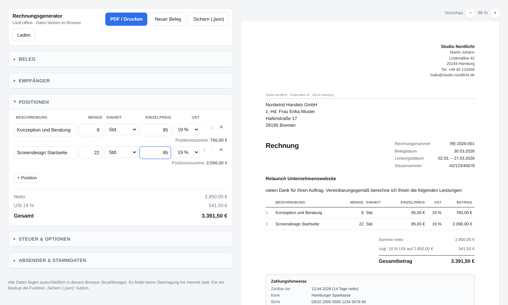
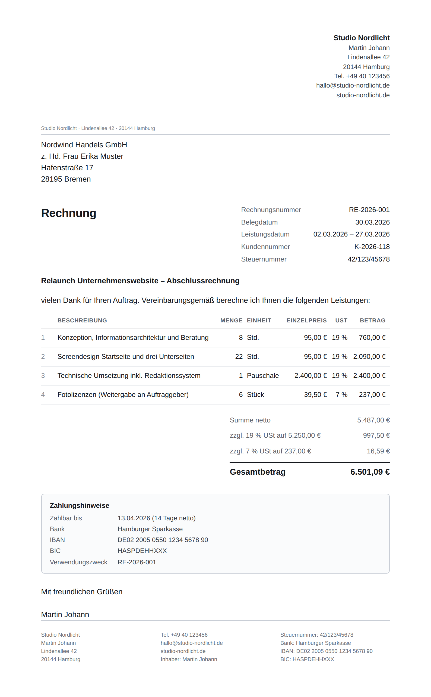

# Rechnungsgenerator für Kleinunternehmer

Ein verkaufsfertiges digitales Mikroprodukt. Verkauft wird auf **Etsy** —
Listing, Bilder und Vermarktungsplan liegen fertig in `marketing/`.

**Das Produkt:** ein Rechnungs- und Angebotsgenerator für den deutschsprachigen
Raum, der aus einer einzigen HTML-Datei besteht. Doppelklick, und er läuft im
Browser — ohne Installation, ohne Konto, ohne Internetverbindung.



---

## Warum sich das verkauft

Buchhaltungs-Abos kosten 9–15 € im Monat. Wer fünf Rechnungen im Monat schreibt,
zahlt dafür 108–180 € im Jahr. Die Alternative war bisher eine Word-Vorlage, in
der man Beträge von Hand ausrechnet.

Dieses Produkt besetzt die Lücke dazwischen: rechnet automatisch, kennt die
deutschen Steuerregeln, kostet einmalig. Das Verkaufsargument steht damit schon
vor dem ersten Satz Werbetext fest.

Dazu kommt ein Vorteil, den Cloud-Anbieter nicht haben: Umsätze, Kundennamen und
Kontodaten verlassen den Rechner des Käufers nicht. Die Datei enthält keine
einzige Verbindung nach außen — kein CDN, keine Schriftart, kein Tracking. Der
Build-Schritt prüft das automatisch und bricht ab, wenn sich doch ein externer
Verweis einschleicht.

---

## Was das Werkzeug kann

| Bereich | Funktionen |
|---|---|
| **Belegarten** | Rechnung, Angebot, Stornorechnung — Beschriftungen und Fußtexte passen sich automatisch an |
| **Rechnen** | Menge × Einzelpreis, Rabatt auf die Nettosumme, Umsatzsteuer je Steuersatz gruppiert, kaufmännische Rundung |
| **Steuerlogik** | Kleinunternehmerregelung § 19 UStG, Reverse-Charge § 13b UStG, gemischte Sätze (19 % / 7 % / 0 %) in einem Beleg |
| **Prüfung** | Hinweis auf fehlende Pflichtangaben nach § 14 UStG, bevor die Rechnung rausgeht |
| **Komfort** | Stammdaten und Kundenliste werden gespeichert, fortlaufende Belegnummern je Jahr und Belegart, Logo-Upload, Live-Vorschau mit Zoom |
| **Ausgabe** | A4-Druckansicht mit sauberen Seitenumbrüchen, PDF über den Browser |
| **Daten** | Speicherung im localStorage, Sichern und Laden als JSON |

Eingaben werden deutsch verarbeitet: `39,50` und `39.50` ergeben denselben
Betrag, ausgegeben wird `1.530,00 €`.



---

## Aufbau des Repositorys

```
produkt/          Das, was der Käufer bekommt
  rechnungsgenerator.html   Das komplette Werkzeug, eine Datei, ~50 kB
  ANLEITUNG.md              Handbuch für Käufer
  LIZENZ.txt                Nutzungslizenz
  beispiel-beleg.json       Ausgefüllter Beispielbeleg

marketing/        Verkauf
  vermarktung.md            Marktplatzentscheidung, Preis, 30-Tage-Plan, Support
  verkaufsstrategie.md      Woher Verkäufe kommen, Ads-Rechnung, Kennzahlen
  rechtstexte.md            Impressum, Widerrufsbelehrung, Prüfung mit 8 Befunden
  etsy-shop.md              Shop „Papierkramerei": Name, Profil, Richtlinien
  etsy-listing.md           Das Listing, Feld für Feld zum Einfügen
  etsy-anleitung.md         Klickstrecke: 30 Schritte vom Konto bis „Veröffentlichen"
  etsy-anleitung.mjs        Erzeugt Klickstrecke als .md und als abhakbare Seite
  listing-bilder.mjs        Erzeugt Listing-Bilder, Banner und Shop-Bild
  listing-video.mjs         Nimmt das Listing-Video auf (braucht ffmpeg)
  gumroad-lemonsqueezy.md   Zweiter Kanal, später

assets/           Screenshots fürs README
  etsy/                     Listing-Bilder, Video, Banner und Shop-Bild
tests/            Abnahmetest im echten Browser
bauen.sh          Erzeugt das auslieferbare ZIP
```

---

## Paket bauen

```bash
./bauen.sh          # erzeugt dist/rechnungsgenerator-kleinunternehmer-v1.0.0.zip
./bauen.sh 1.1.0    # mit eigener Versionsnummer
```

Das Skript kopiert die Produktdateien zusammen, legt eine `START HIER.txt` bei,
prüft die HTML-Datei auf externe Verweise und packt alles als ZIP. Ergebnis:
rund 20 kB — schnell heruntergeladen, sofort nutzbar.

---

## Tests

```bash
node tests/abnahme.mjs
```

Der Test öffnet das Produkt in Chromium und prüft 85 Punkte: Rechenwege
einschließlich Rundung bei gemischten Steuersätzen, § 19 und Reverse-Charge,
Fälligkeitsberechnung über Monats- und Schaltjahresgrenzen, Belegartwechsel,
Persistenz über einen Neuladevorgang, Import/Export, HTML-Escaping bei
Sonderzeichen, A4-Maße im Druck, das Verhalten auf 390 px Breite, die Auswahl
eigener Mengeneinheiten sowie den Betrieb ohne dauerhaften Speicher
(privates Fenster, blockierte Website-Daten, eingebettete Ansicht).

Voraussetzung ist Playwright (`npm install --save-dev playwright`, danach
`npx playwright install chromium`). Nach jeder Änderung an
`produkt/rechnungsgenerator.html` sollte der Test grün durchlaufen.

---

## Vor dem ersten Verkauf

1. `./bauen.sh` ausführen und die ZIP in einem **frischen Browserprofil**
   testen — so, wie ein Käufer sie öffnet.
2. PDF-Export in Chrome, Firefox und Safari prüfen. Im Druckdialog müssen
   **Hintergrundgrafiken** aktiviert sein, sonst fehlt der Rahmen um die
   Zahlungshinweise. Dieser Hinweis steht auch in der Anleitung.
3. `marketing/vermarktung.md` durchgehen. Kurzfassung: verkauft wird auf
   **Etsy**, weil dort der Suchverkehr mit Kaufabsicht liegt — Gumroad und
   Lemon Squeezy sind Kassensysteme ohne eigene Besucher. Einführungspreis
   9,90 €, danach 14,90 €.
4. Impressum, Widerrufsbelehrung und die Checkbox zum Erlöschen des
   Widerrufsrechts beim Checkout einrichten.

---

## Grenzen des Produkts

Ehrlich benannt, weil es in den Verkaufstexten genauso steht — das spart
Rückfragen und Erstattungen:

* Kein Mahnwesen, keine Zeiterfassung, kein DATEV-Export.
* Keine strukturierte E-Rechnung (ZUGFeRD / XRechnung), nur PDF. Für den
  **Empfang** von E-Rechnungen gilt in Deutschland seit 2025 eine Pflicht, für
  das **Ausstellen** laufen gestaffelte Übergangsfristen.
* Keine Synchronisierung zwischen Geräten — bewusst so, Übertragung läuft über
  die JSON-Sicherung.
* Arbeitshilfe, keine Steuerberatung.

Der naheliegendste nächste Ausbauschritt ist ein GiroCode (QR-Code für
Überweisungen) auf der Rechnung. Weitere Ideen in der Reihenfolge ihres
Nutzens stehen am Ende von `marketing/vermarktung.md`.

---

## Lizenz

Der Inhalt von `produkt/` wird unter den Bedingungen in `produkt/LIZENZ.txt` an
Endkunden ausgeliefert. Dieses Repository ist die Entwicklungsfassung und nicht
zur Weitergabe bestimmt.
